

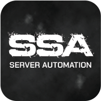

# SCUM Server Automation

**The all-in-one manager for SCUM dedicated servers.**

Automated hosting · a full Discord bot · a web admin panel · a live map · leaderboards · an in-game economy · player management · and a real plugin platform.

[**🌐 scumsa.com**](https://scumsa.com) &nbsp;·&nbsp; [**📖 Documentation**](https://scumsa.com/docs) &nbsp;·&nbsp; [**⬇ Download**](#-download) &nbsp;·&nbsp; [**🧩 Plugins**](#-plugins) &nbsp;·&nbsp; [**🛠 Build a plugin**](#-build-your-own)

 

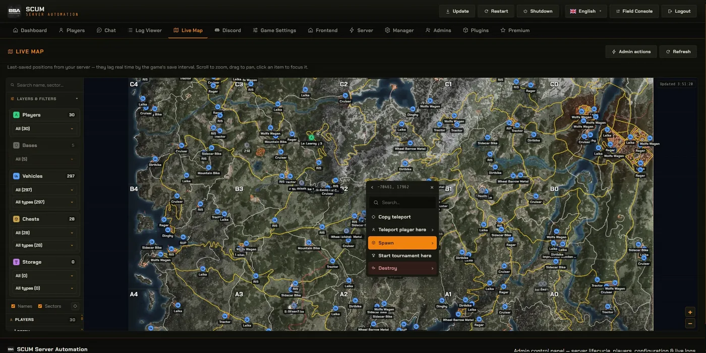

---

## What is it?

**SCUM Server Automation (SSA)** runs your SCUM dedicated server end-to-end so you don't have to babysit it. It installs and updates the server, keeps it alive with scheduled restarts and backups, and gives you a polished web panel and Discord bot to run everything — plus a plugin platform so the community can extend it.

- **Hands-off hosting** — automated install, game updates, scheduled restarts and backups, crash detection and auto-recovery.
- **Web admin panel** — a modern dashboard for server control, players, configuration and live logs, with a **Live Map** of players, vehicles, bases and chests (and in-game spawn / teleport straight from the map).
- **Discord bot** — status embeds, log feeds (kills, economy, raids, logins…), leaderboards, player linking and admin commands.
- **Players & economy** — stats, skills, leaderboards (weekly + all-time), squads, and the in-game trader economy at a glance.
- **Public Field Console** — a public stats site for your players.
- **Plugin platform** — add whole new features with manager plugins and in-game UE4SS mods (see below).

Everything is at **[scumsa.com](https://scumsa.com)**.

---

## 📸 A look around

<table>
<tr>
<td width="50%">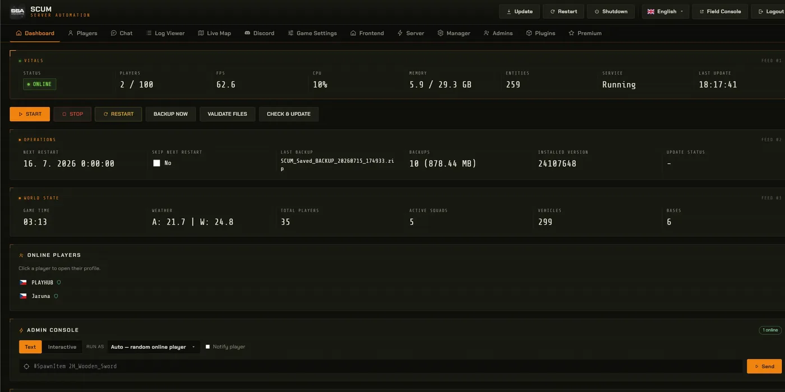 <b>Dashboard</b> — server control, status and quick actions.</td>
<td width="50%">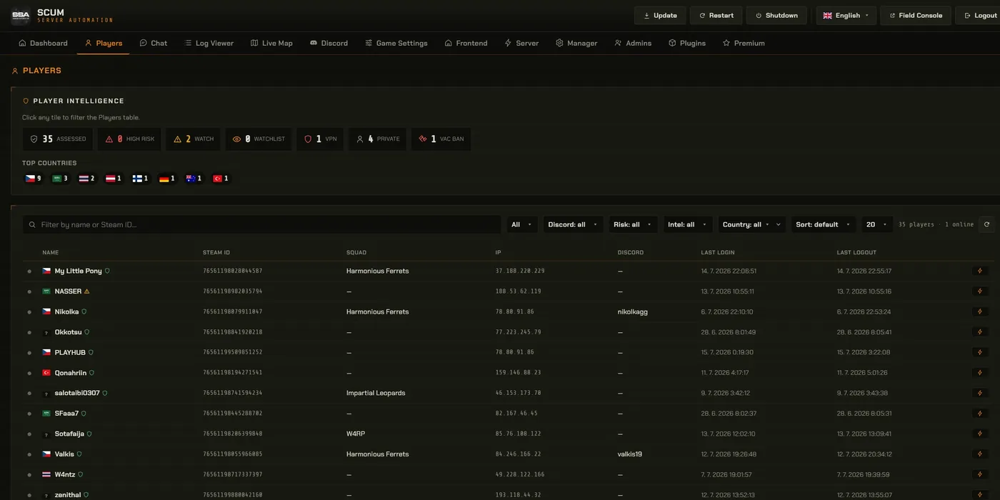 <b>Players</b> — stats, skills, squads and admin actions.</td>
</tr>
<tr>
<td width="50%">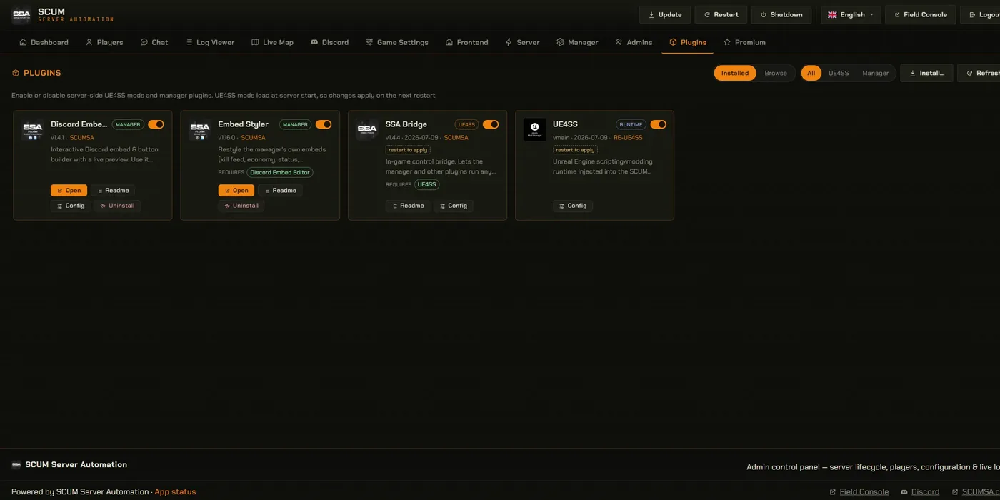 <b>Plugins</b> — install, enable and configure, right in the panel.</td>
<td width="50%">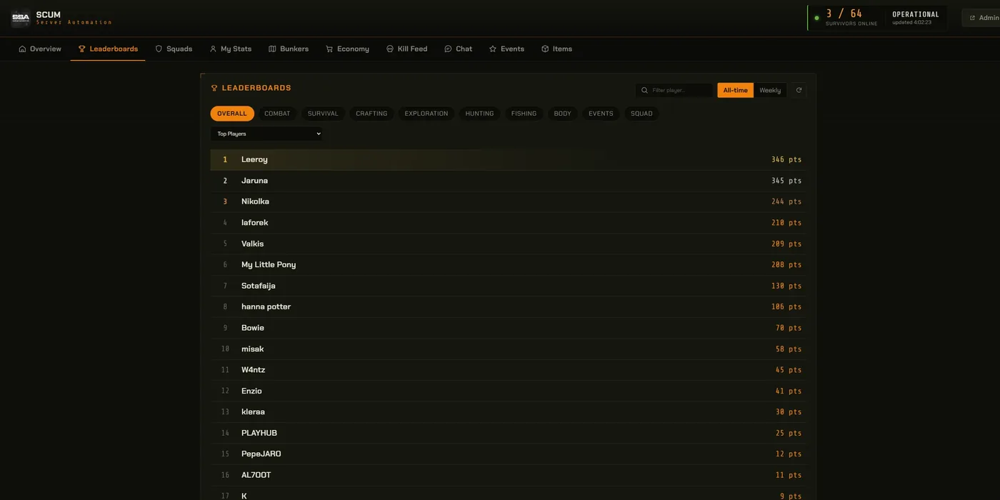 <b>Public Field Console</b> — a public stats site your players can browse.</td>
</tr>
</table>

More screenshots and a live demo on [**scumsa.com**](https://scumsa.com).

---

## ⬇ Download

The manager lives in [**`manager/`**](manager) — grab the `.zip`, unpack it, and follow the [Getting started guide](https://scumsa.com/docs). The always-current release and full changelog are on [scumsa.com](https://scumsa.com).

Two kinds of build sit there, and the filename tells you which:

| | |
|---|---|
| `SCUM-Server-Automation-v<x>.zip` | the **stable** release. This is the one to run a real server on. |
| `unstable_SCUM-Server-Automation-v<x>.zip` | a **test build**, newer and less proven. Take it if you want to try something early or help find problems — not for a server you care about. The manager only ever updates itself to a test build if you opt in, and it never downgrades you back. |

### 🔌 The SSA Bridge, on its own

[**`ssa_bridge/`**](ssa_bridge) holds the **SSA Bridge** as a standalone download: the in-game mod that lets anything talk to a running SCUM server — spawns, teleports, admin commands, and reads of the live world that no log file and no save can give you.

**It is free, and it does not need the manager.** Every module, every command and every read works on its own; unpack it into your server's `SCUM/Binaries/Win64/` and it runs. UE4SS is in the archive, so there is nothing else to fetch. A licence changes exactly one thing: whether joining players see a single chat line naming the bridge.

> **What's in this repository.** The public home for the SSA **plugins**, developer **examples**, the manager **release** and the **bridge**. The manager's own source is closed — everything you need to *run* a server is here plus [scumsa.com](https://scumsa.com).

---

## 🧩 Plugins

Plugins extend the manager — new admin screens, Discord tools, in-game rewards and gameplay tweaks. They're installed from the admin panel's **Plugins** section (a Premium feature) and update themselves from there. The source below is public so you can see exactly what each one does.

| | Plugin | What it does |
|---|---|---|
| 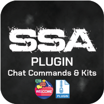 | [**Chat Commands & Kits**](plugins/ssa-plugins/commands-kits) | Custom in-game `/commands` that reply and run admin actions — teleports, currency, spawns, weather — plus reward kits and packs, with live tokens, costs, cooldowns and per-player limits. |
| 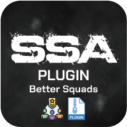 | [**Better Squads**](plugins/ssa-plugins/better-squads) | Squad-only chat in game, and alerts when a squadmate connects, dies, gets a kill, has their base raided or the roster changes. Every line is a template with live tokens, including the sector and the reader's own distance and direction. |
| 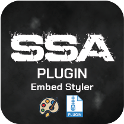 | [**Discord Embeds**](plugins/ssa-plugins/discord-embeds) | Everything Discord-embed in one place: write a message with a live preview that renders real markdown, your own emoji and live server data, send it and edit it in place afterwards — and restyle the manager's own embeds while you are there. |
| 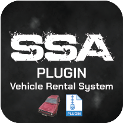 | [**Vehicle Rental System**](plugins/ssa-plugins/vehicle-rental) | Players rent vehicles from in-game chat or a Discord menu — pick one, choose a duration, pay in money or gold, and it is spawned beside them with the whole lifecycle run for you: reminders, extensions, auto-removal. |
| 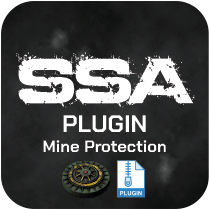 | [**Mine Protection**](plugins/ssa-plugins/mine-protection) | Punishes players who arm a mine or trap outside their own (or their squad's) flag area — squad-aware, escalating, and it teleports the offender onto their own armed mine. |

Browse and get them in-app, or on the [Plugins page at scumsa.com](https://scumsa.com/plugins.php).

---

## 🛠 Build your own

Anyone can write plugins against a small, documented API — no access to the manager's source needed. Start from the runnable examples in [**`plugins/examples/`**](plugins/examples):

- [**`hello-plugin`**](plugins/examples/hello-plugin) — a complete manager plugin that demonstrates *every* feature end-to-end: config, events, HTTP routes, the game & manager databases, item/vehicle images, in-game chat and `/commands`, the SSA Bridge, Discord, scheduling, an admin workspace tab and a public Field Console tab.
- [**`ue4ss-mod-example`**](plugins/examples/ue4ss-mod-example) — a small, safe UE4SS (Lua) mod skeleton for in-game work.
- [**`ssa-plugin-sdk.d.ts`**](plugins/examples/ssa-plugin-sdk.d.ts) — TypeScript typings for the whole `host` / `SSA` / `FC` surface (editor autocomplete).

The complete **Plugin SDK** — every method, all events, and the UE4SS guide — is at [**scumsa.com/docs**](https://scumsa.com/docs).

---

## 📄 License

The plugins and the manager release are **© SCUM Server Automation — all rights reserved** (see [`LICENSE`](LICENSE)); the source is public for transparency, not for reuse. The developer examples in [`plugins/examples/`](plugins/examples) are **MIT-licensed** — copy them freely as a starting point for your own plugins.

---

## 🔗 Links

- **Website & downloads** — [scumsa.com](https://scumsa.com)
- **Documentation** — [scumsa.com/docs](https://scumsa.com/docs)
- **Plugins** — [scumsa.com/plugins.php](https://scumsa.com/plugins.php)

Made for the SCUM community · [scumsa.com](https://scumsa.com)

