

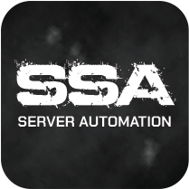

# SCUM Server Automation

**The all-in-one manager for SCUM dedicated servers, and the tools around it.**

Hosting · admin panel · live map · Discord bot · Field Console · SSA Bridge · plugins · and the SCUMSA Launcher for players.

[**🌐 scumsa.com**](https://scumsa.com) &nbsp;·&nbsp; [**📖 Documentation**](https://scumsa.com/docs) &nbsp;·&nbsp; [**⬇ Download**](#-download) &nbsp;·&nbsp; [**🎮 Launcher**](#-the-scumsa-launcher-for-players) &nbsp;·&nbsp; [**🧩 Plugins**](#-plugins) &nbsp;·&nbsp; [**🛠 Build a plugin**](#-build-your-own)

 

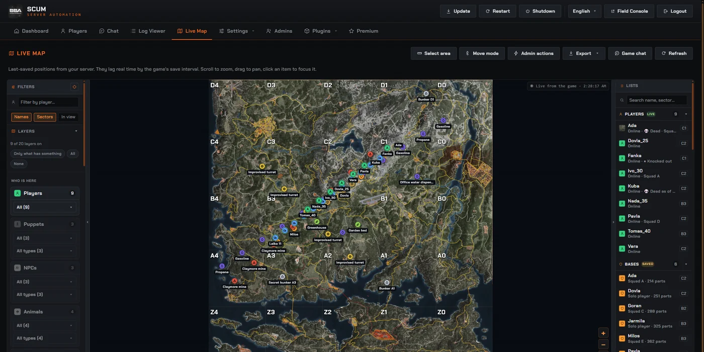

---

## What is it?

**SCUM Server Automation (SSA)** runs your SCUM dedicated server end to end so you don't have to babysit it. It installs and updates the server and keeps it alive with scheduled restarts and backups. You run everything from a web panel and a Discord bot, and plugins extend it.

- **Hands-off hosting:** automated install, game updates, scheduled restarts and backups, crash detection and auto-recovery.
- **Web admin panel:** server vitals, players with risk checks, squads, the in-game chat, a log viewer and every game setting explained. Each admin gets their own permissions, and it works on a phone.
- **Live map:** players, vehicles, bases, traps and events on the real island. Teleport, heal, give items or spawn things straight from the map, act on everything inside a circle, and lay out custom zones.
- **Discord bot:** server status, restart warnings, log feeds (kills, raids, economy, logins…), leaderboards, account linking and admin commands.
- **Public Field Console:** a public page for your players with server status, leaderboards, squads, their own stats and skills, their bases and vehicles on a map, bunkers, events and chat.
- **Economy:** trader funds and stock at every outpost, trader prices and restock rules in one place.
- **In-game control:** the free **SSA Bridge** runs inside the game. It gives the panel, the map, Discord and plugins live readings and actions.
- **Server browser:** your server's live player count on [scumsa.com](https://scumsa.com/servers/), with your own description and votes.
- **Plugin platform:** add whole new features with manager plugins and in-game UE4SS mods (see below).

The manager is free to run. **Premium** adds a paid layer on top: the live map, in-game control, the game database with pictures, plugins and more. See [Premium](https://scumsa.com/docs/owners/premium).

---

## 📸 A look around

<table>
<tr>
<td width="50%">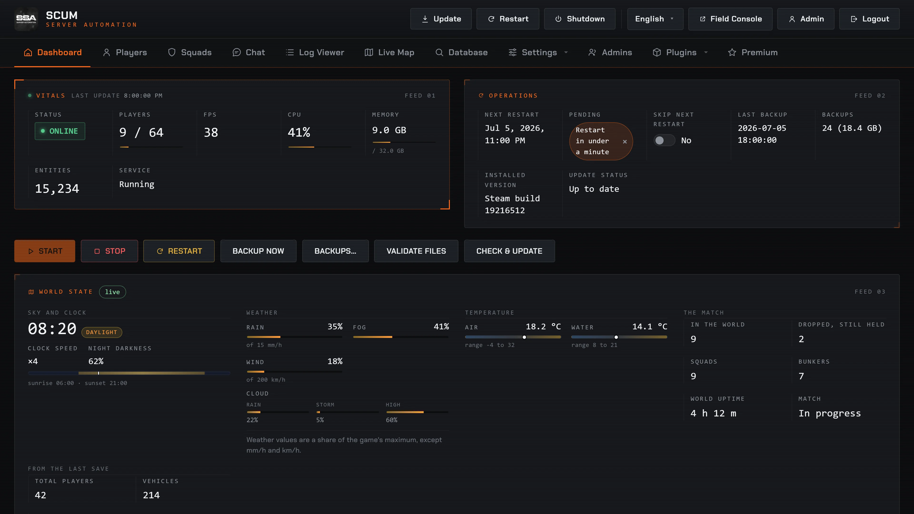 <b>Dashboard:</b> server vitals, the next restart, backups and the live world at a glance.</td>
<td width="50%">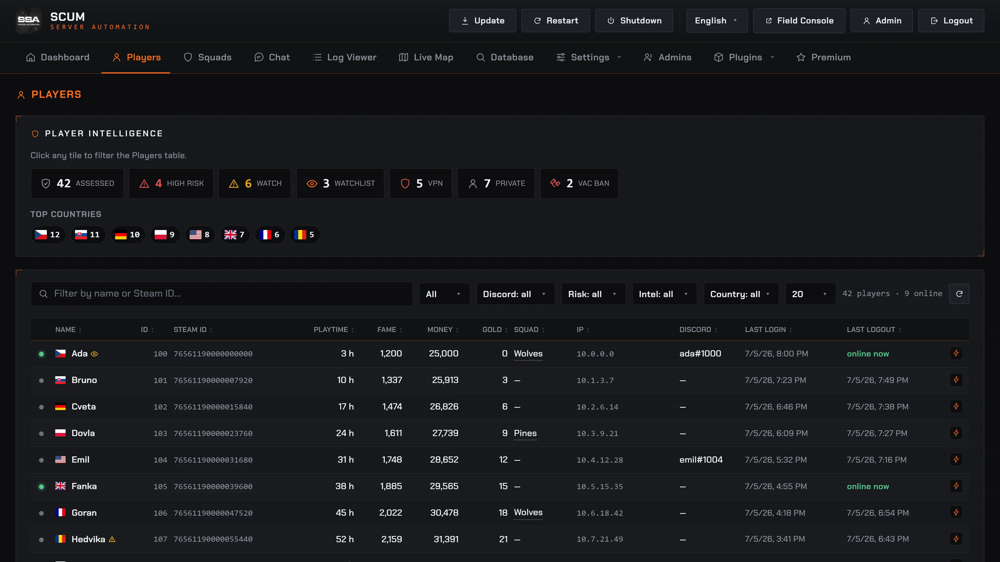 <b>Players:</b> every player with risk score, VPN and VAC checks, country and playtime.</td>
</tr>
<tr>
<td width="50%">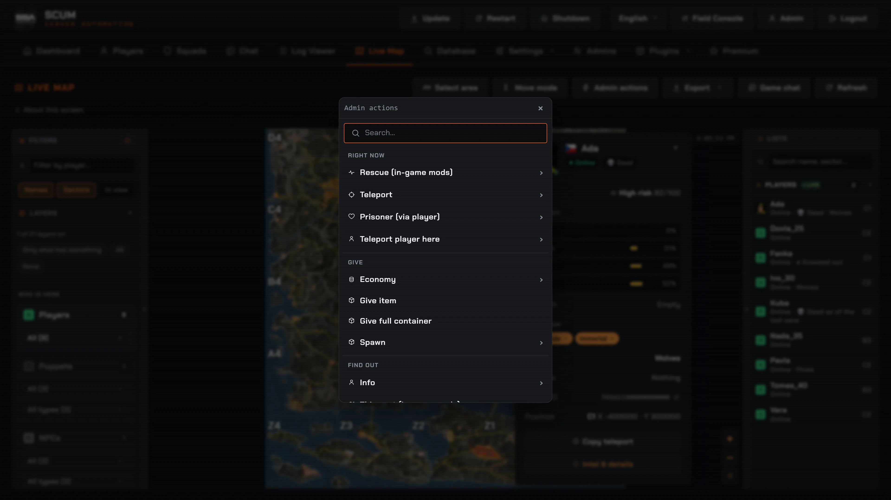 <b>In-game actions:</b> teleport, heal, give items or spawn things straight from the map.</td>
<td width="50%">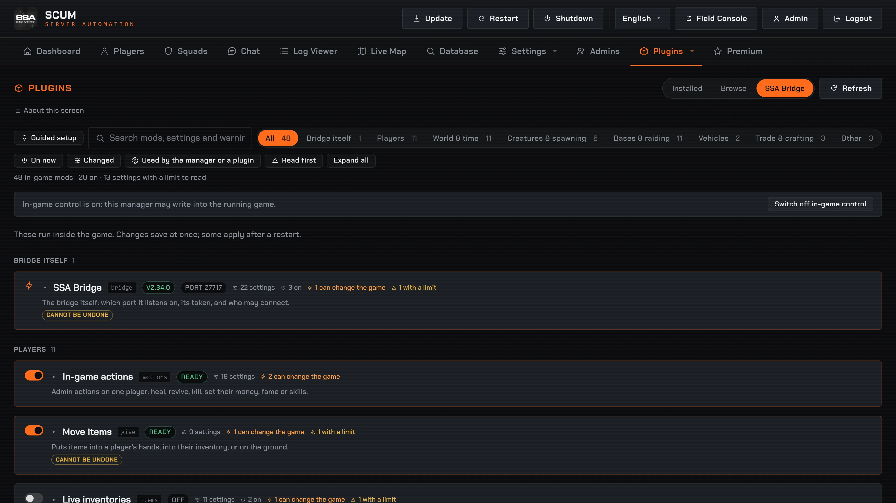 <b>SSA Bridge modules:</b> switch each in-game module on and tune it from the panel.</td>
</tr>
<tr>
<td width="50%">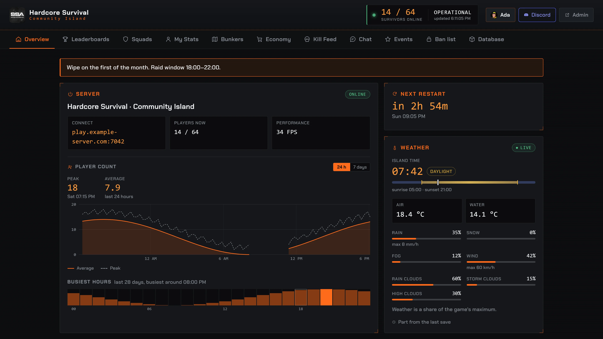 <b>Field Console:</b> your public server page with status, player count, weather and the next restart.</td>
<td width="50%">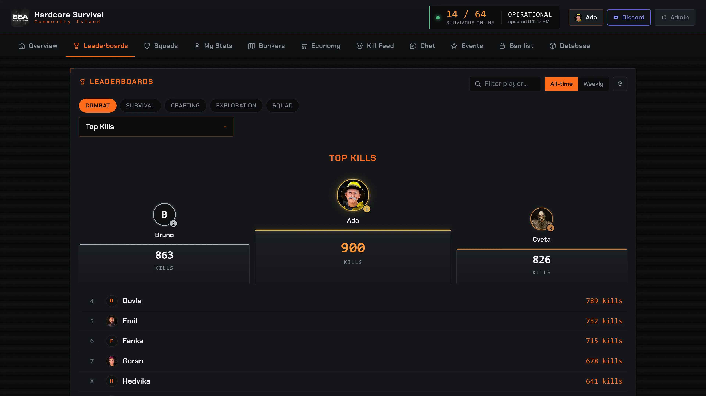 <b>Leaderboards:</b> combat, survival, crafting and squad rankings, all-time and weekly.</td>
</tr>
<tr>
<td width="50%">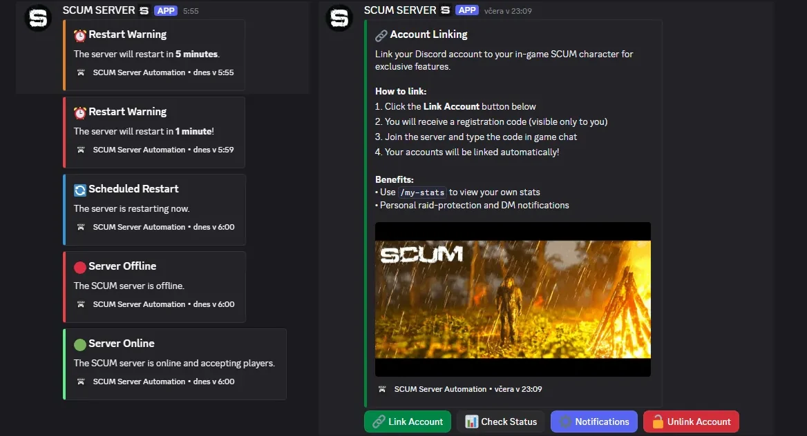 <b>Discord bot:</b> restart warnings, server status and account linking, all posted for you.</td>
<td width="50%">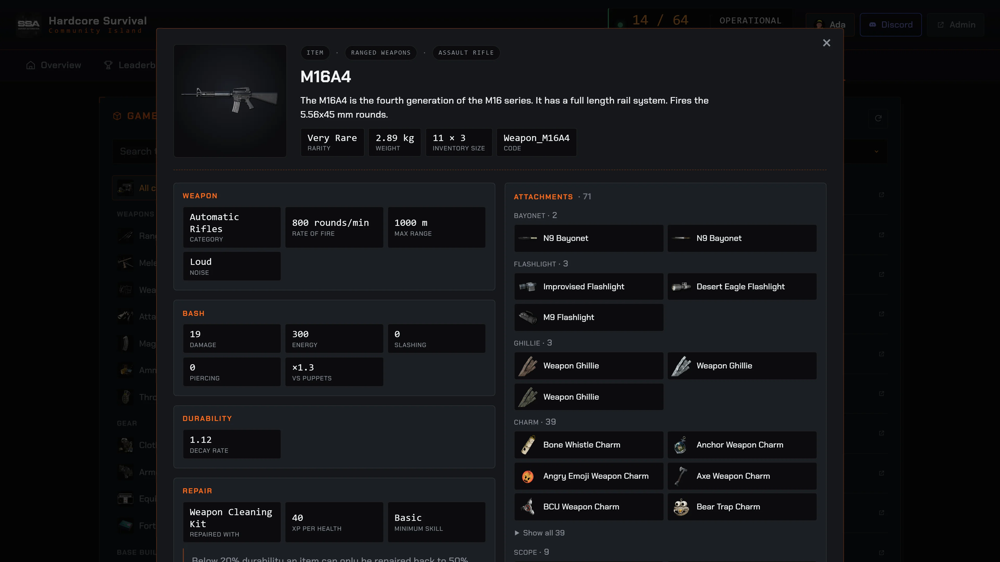 <b>Game database:</b> stats, attachments and repair for every item, read from the game files.</td>
</tr>
</table>

More screenshots on [**scumsa.com/features.php**](https://scumsa.com/features.php) and [**scumsa.com/field-console.php**](https://scumsa.com/field-console.php).

---

## ⬇ Download

The manager lives in [**`manager/`**](manager). Grab the `.zip`, unpack it, and follow the [Getting started guide](https://scumsa.com/docs). The always-current release and the full changelog are on [scumsa.com](https://scumsa.com).

The filename tells you which kind of build it is:

| | |
|---|---|
| `SCUM-Server-Automation-v<x>.zip` | the **stable** release. This is the one to run a real server on. |
| `unstable_SCUM-Server-Automation-v<x>.zip` | a **test build**, newer and less proven. Take it to try something early or help find problems, not for a server you care about. The manager only updates itself to a test build if you opt in, and it never downgrades you back. |

### 🔌 The SSA Bridge, on its own

[**`ssa_bridge/`**](ssa_bridge) holds the **SSA Bridge** as a standalone download: the in-game mod that lets anything talk to a running SCUM server. Spawns, teleports, admin commands, and reads of the live world that no log file and no save can give you. A file named `unstable_…` is a test build.

**It is free, and it does not need the manager.** Every module, command and read works on its own. Unpack it into your server's `SCUM/Binaries/Win64/` and it runs. UE4SS is in the archive, so there is nothing else to fetch. A licence changes exactly one thing: whether joining players see a single chat line naming the bridge.

**Building your own tool?** [`ssa_bridge/sdk/`](ssa_bridge/sdk) has typings for the whole interface and a small client for Node and for Python. Your bot, website or tool can then talk to the bridge without the manager.

### 📡 The SSA Reporter, for the server browser

[**`ssa_reporter/`**](ssa_reporter) holds the **SSA Reporter**: a small in-game mod that tells [scumsa.com](https://scumsa.com) your server's name, player count, version, game time and uptime once a minute. Your listing in the server browser is then live and yours to claim, even when the official master list is stale or wrong. Unpack it into your server's `SCUM/Binaries/Win64/`, paste the token from your scumsa account page into its config, restart. It sends nothing from the save and no player names. Run the bridge or the Reporter, not both: the bridge has the same report built in.

### 🎮 The SCUMSA Launcher, for players

[**`launcher/`**](launcher) holds the **SCUMSA Launcher** installer, free for every SCUM player:

- **Every SCUM server** with your real ping over the game's own connection. Filter by mode, region, country, mods and free slots.
- **One press to join.** Your favourites, recent servers and characters come from your own game.
- **The right mods for each server.** Join a server that lists mods and the launcher installs exactly those. Join a normal server and they come out again. Mods only load without BattlEye, so a modded game cannot join protected servers; the launcher asks you first.

Run the installer once; the launcher updates itself. More on the [launcher page](https://scumsa.com/launcher.php) and in the [launcher guide](https://scumsa.com/docs/players/launcher).

<table>
<tr>
<td width="50%">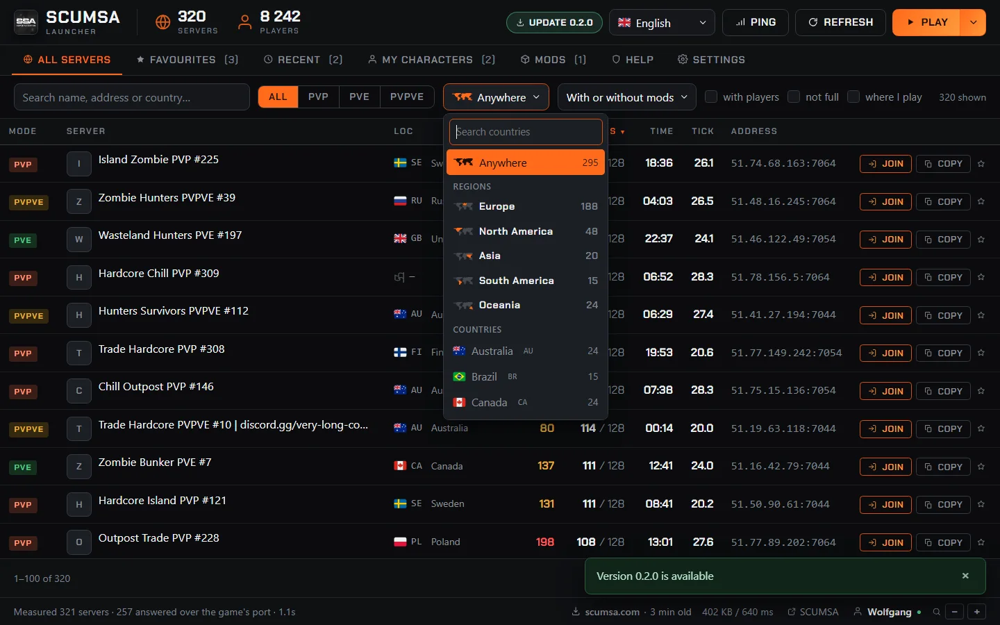 <b>Server list:</b> every server with ping, players and mode, filtered by region or country.</td>
<td width="50%">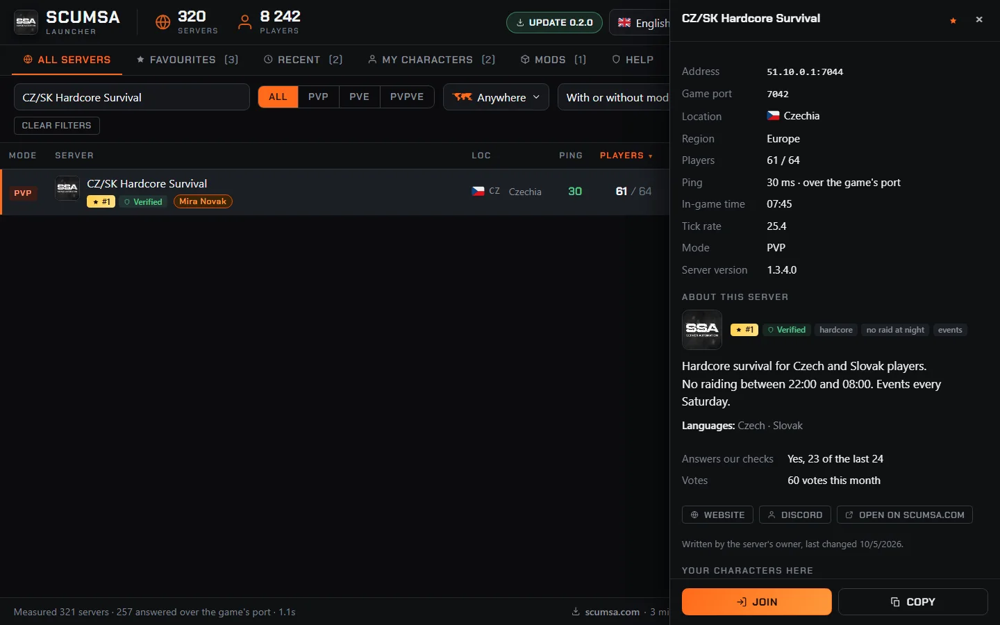 <b>Server details:</b> the owner's own description, votes and one press to join.</td>
</tr>
</table>

> **What's in this repository.** The public home for the SSA **plugins**, developer **examples**, the manager **release**, the **bridge**, the **Reporter** and the **launcher**. The manager's own source is closed; everything you need to *run* a server, or to *play* on one, is here plus [scumsa.com](https://scumsa.com).

---

## 🌐 scumsa.com

The website is the home of all of it, and a few things live only there:

- **[Server browser](https://scumsa.com/servers/):** every SCUM server, with a live player count for servers that report it. Claim your server to add a description, tags, languages and links, and let players vote for it. Owners get a vote API to reward voters in game.
- **[Game database](https://scumsa.com/database/):** items, vehicles, creatures, recipes, traders and more, with pictures, read from the game files.
- **[Map](https://scumsa.com/map/):** the island with every named place, the sector grid and search.
- **[Mods](https://scumsa.com/mods):** the client mod library the launcher installs from.
- **[Plugins](https://scumsa.com/plugins.php)** and **[documentation](https://scumsa.com/docs)** for owners, players and developers.

---

## 🧩 Plugins

Plugins extend the manager with new admin screens, Discord tools, in-game rewards and gameplay features. They're installed from the admin panel's **Plugins** section (a Premium feature) and update from there. The source below is public so you can see exactly what each one does.

| | Plugin | What it does |
|---|---|---|
| 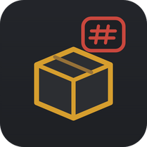 | [**Chat Commands & Kits**](plugins/ssa-plugins/commands-kits) | Custom in-game `/commands` that reply and run admin actions (teleports, currency, spawns, weather), plus reward kits and packs, with live tokens, costs, cooldowns and per-player limits. |
|  | [**Better Squads**](plugins/ssa-plugins/better-squads) | Squad-only chat in game, and alerts when a squadmate connects, dies, gets a kill, has their base raided or the roster changes. Every line is a template with live tokens, including the sector and the reader's own distance and direction. |
|  | [**Discord Embeds**](plugins/ssa-plugins/discord-embeds) | Everything Discord-embed in one place: write a message with a live preview, your own emoji and live server data, send it and edit it in place afterwards, and restyle the manager's own embeds. |
|  | [**Vehicle Rental System**](plugins/ssa-plugins/vehicle-rental) | Players rent vehicles from in-game chat or a Discord menu: pick one, choose a duration, pay in money or gold, and it is spawned beside them, with reminders, extensions and auto-removal handled for you. |
|  | [**Mine Protection**](plugins/ssa-plugins/mine-protection) | Punishes players who arm a mine or trap outside their own (or their squad's) flag area: squad-aware, escalating, and it teleports the offender onto their own armed mine. |
| 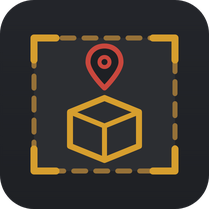 | [**Loot Zones**](plugins/ssa-plugins/loot-zones) | Rotate better loot around the island. Each zone is drawn on the players' map, its loot goes live straight away, and it can keep sentries and zombies out while guards of your choosing stand watch. |
|  | [**Raid Window**](plugins/ssa-plugins/raid-window) | Stops defenders ending a raid by logging out: while a base is taking raid damage, its offline protection is pushed back so the raid can be finished. |
|  | [**More Chat Messages**](plugins/ssa-plugins/more-chat-messages) | Announce kills, joins and leaves, cargo drops, game events, bunkers and raids in the game's own chat, each switched on separately and worded your way. |

Browse and get them in-app, or on the [Plugins page at scumsa.com](https://scumsa.com/plugins.php).

---

## 🛠 Build your own

Anyone can write plugins against a small, documented API, with no access to the manager's source needed. Start from the runnable examples in [**`plugins/examples/`**](plugins/examples):

- [**`hello-plugin`**](plugins/examples/hello-plugin): a complete manager plugin that shows every feature end to end. It covers config, events, HTTP routes, the game and manager databases, item and vehicle images, in-game chat and `/commands`. It also covers the SSA Bridge, Discord, scheduling, an admin tab and a public Field Console tab.
- [**`ue4ss-mod-example`**](plugins/examples/ue4ss-mod-example): a small, safe UE4SS (Lua) mod skeleton for in-game work.
- [**`ssa-plugin-sdk.d.ts`**](plugins/examples/ssa-plugin-sdk.d.ts): TypeScript typings for the whole `host` / `SSA` / `FC` surface (editor autocomplete).

The complete **Plugin SDK**, with every method, all events and the UE4SS guide, is at [**scumsa.com/docs**](https://scumsa.com/docs).

---

## 📄 License

The plugins and the manager release are **© 2026 Martin Zámečník, all rights reserved** (see [`LICENSE`](LICENSE)); the source is public for transparency, not for reuse. The developer examples in [`plugins/examples/`](plugins/examples) and the bridge SDK in [`ssa_bridge/sdk/`](ssa_bridge/sdk) are **MIT-licensed**: copy them freely as a starting point for your own plugins and tools.

---

## 🔗 Links

- **Website & downloads:** [scumsa.com](https://scumsa.com)
- **Documentation:** [scumsa.com/docs](https://scumsa.com/docs)
- **Plugins:** [scumsa.com/plugins.php](https://scumsa.com/plugins.php)
- **SCUMSA Launcher:** [scumsa.com/launcher.php](https://scumsa.com/launcher.php)
- **SSA Bridge:** [scumsa.com/bridge.php](https://scumsa.com/bridge.php)
- **SSA Reporter:** [scumsa.com/reporter.php](https://scumsa.com/reporter.php)
- **Server browser:** [scumsa.com/servers](https://scumsa.com/servers/)
- **Game database:** [scumsa.com/database](https://scumsa.com/database/)

Made for the SCUM community · [scumsa.com](https://scumsa.com)

